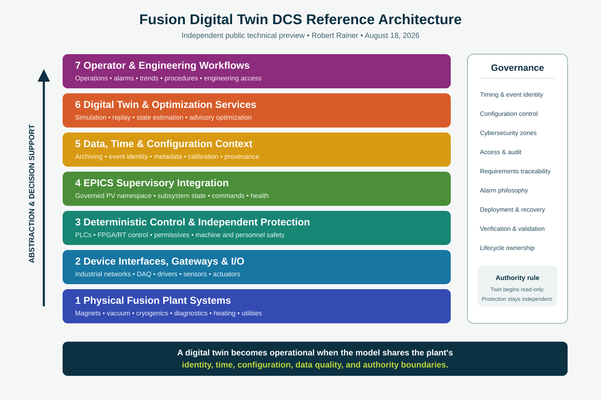

# Fusion Digital Twin DCS Reference Architecture

## A public technical preview by Robert Rainer

This repository presents a facility-scale controls and digital-twin architecture for fusion research and development. It is an independent engineering concept developed by Robert Rainer using public information, established scientific-controls practice, and original systems-engineering work.

It is not affiliated with, endorsed by, or representative of the internal systems of Thea Energy or any other fusion company.

## The idea

A useful fusion digital twin cannot be a single physics model sitting beside the plant. It must be connected to the operational control system through governed interfaces, shared identifiers, trustworthy time alignment, configuration control, and explicit boundaries between supervisory control, deterministic control, and safety.

This reference architecture uses EPICS as a supervisory integration fabric while leaving fast control and independent protection in the layers where they belong. The digital twin is treated as a lifecycle capability: it can begin in simulation, support controls development and virtual commissioning, then evolve into replay, model comparison, diagnostics, optimization, and operator decision support.

## Public architecture

The public design describes these layers:

1. Physical plant, instruments, actuators, and utility systems
2. Safety-rated and deterministic control systems
3. Device interfaces, gateways, and subsystem IOCs
4. EPICS supervisory integration and a governed PV namespace
5. Timing, event identity, configuration, archiving, and data services
6. Digital-twin, replay, estimation, and optimization services
7. Operator, engineering, and research workflows

The system is intentionally divided into operational zones so that simulation or analytics cannot silently become a safety authority. See [Architecture Overview](docs/architecture-overview.md).

## What is public—and what is reserved

This technical preview publishes the system structure, engineering principles, lifecycle, and collaboration model. Deployment-grade details are intentionally withheld, including exact device inventories, addresses, credentials, protection thresholds, facility-specific network maps, detailed PV databases, vendor BOMs and cost models, and implementation-specific automation.

See [Publication Boundary](docs/publication-boundary.md) for the full distinction.

## Technical article

The companion article, [From Simulation to Operations: A DCS Infrastructure for Fusion Digital Twins](ARTICLE.md), explains the reasoning behind the design and how a fusion facility could adopt it incrementally.

## Collaboration

I am interested in collaborating with fusion facilities, laboratories, universities, and engineering teams that want to evaluate, adapt, or deploy this architecture. Engagement can begin with an architecture workshop, a bounded subsystem pilot, or a simulation-to-IOC integration demonstrator.

Contact: **rainer1370@gmail.com**  
Portfolio: **[rainer1370.com](https://rainer1370.com)**  
GitHub: **[Rainer1370](https://github.com/Rainer1370)**

## Authorship and permitted use

Copyright © 2026 Robert Rainer. All rights reserved.

This repository is published for technical review, professional discussion, and collaboration. No license is granted for commercial implementation, redistribution, or derivative deployment. See [LICENSE.md](LICENSE.md). Contact the author to discuss evaluation or deployment rights.

## Status

**Public technical preview — August 18, 2026.** This is a reference architecture, not a certified design, safety basis, operating procedure, or procurement specification.
